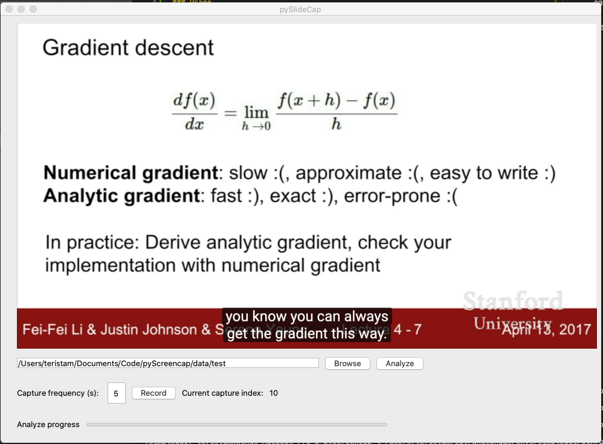

# pyScreencap
Python script to capture online video slide show and convert it to PDF. The script will capture screenshot at a fixed frequency, then analyze the difference between frames to identify slide transitions. Finally, the slides are saved as PDF files. By default, the file name of the PDF file is the same as the image folder name.

### Depedency
- scikit-image, pyscreenshot, reportlab

### Usage
- run `python PyScreencap.py`
- Click 'Browse' button to specify the image save location
- Specify the capture frequency
- Click 'Record' to start recording. During recording, the latest-captured screenshot will be shown
- Click 'Stop' to stop the recording, then click 'Analyze' to start analyzing the captured images and convert them to pdf

### Known limitations
 - The script only works well on videos that are primarily slide shows
 - Currently, it only capture image on the 1st monitor if multiple monitors are present.